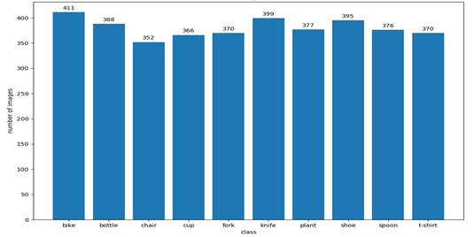

# 1. Description of Data

The dataset comprises real-world images spanning 10 distinct object categories, including **bike, bottle, chair, cup, fork, knife, plant, shoe, spoon,** and **t-shirt**. Real-world images were captured to ensure a diverse and representative dataset supporting the principles of independent and identically distributed (i.i.d.) data for robust model training and evaluation in machine learning.

Dataset link: [EverydayObjects-10 Dataset on Kaggle](https://www.kaggle.com/datasets/saipavankumaryedduri/everydayobjects-10)

## 1.1 Data Collection Methodology

To create a dataset that accurately represents real-world scenarios, images were captured from various perspectives, ensuring that some instances of the same category remain pairwise disjoint. This means that objects were photographed from different angles, orientations, and settings, preventing redundancy and ensuring the model generalizes well to unseen data.

Furthermore, no restrictions were imposed on the image dimensions (height and width), allowing for the natural variance in real-world image sizes. The images were taken across multiple resolutions and lighting conditions by different people at different locations, reinforcing the dataset’s diversity and preventing biases that could arise from uniform environmental conditions.

These measures were implemented to simulate real-world variance and ensure that the dataset is independent, meaning that one image does not influence another, and identically distributed, as each class is well-represented without an inherent bias toward specific conditions.

Under these specific conditions, an image database is created with a total of **3,804 images** collected across the 10 categories. The distribution of images per class is visualized in **Figure 1**, demonstrating the dataset's near-uniform class distribution, which helps mitigate class imbalance issues in the classification task.

## 1.2 Dataset Statistics 

| Metric             | Value                          |
|--------------------|--------------------------------|
| Number of Images   | 3,804 images                   |
| Mean (R, G, B)     | (0.5285, 0.4851, 0.4376)        |
| Std (R, G, B)      | (0.2285, 0.2215, 0.2254)        |

  

<em>Figure 1: Distribution of images per class.</em>

